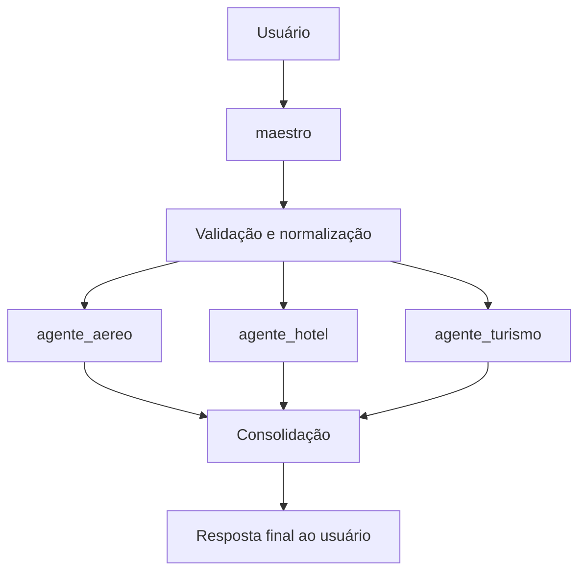
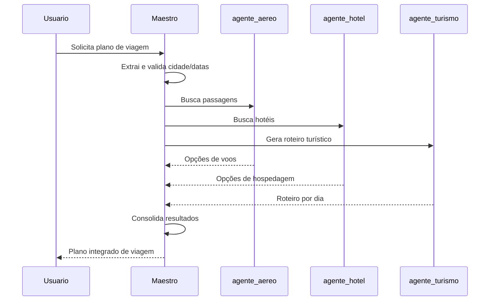
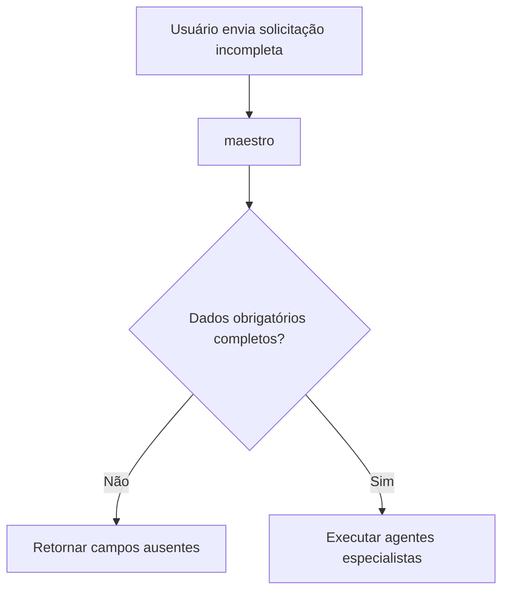
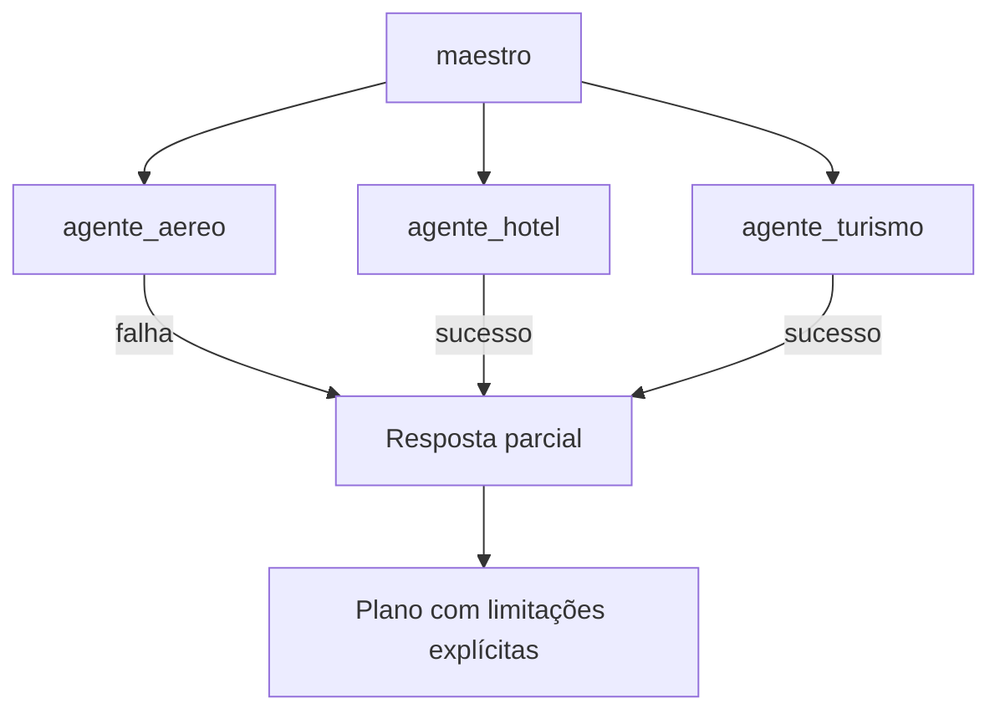
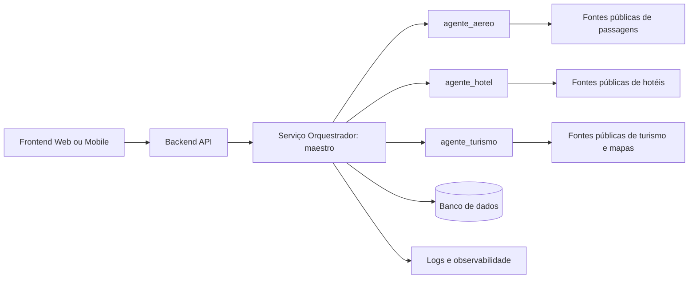

# plano.md — Planejamento de Orquestrador de Agentes para Planejamento de Viagens

## 1. Visão geral

Este documento descreve o planejamento de uma aplicação baseada em agentes inteligentes para sugerir planos completos de viagem a partir de informações fornecidas por um usuário.

A aplicação deverá receber, no mínimo, os seguintes dados:

- Cidade de destino da viagem.
- Data de saída, isto é, data de início da viagem.
- Data de retorno, isto é, data final da viagem.

Com base nessas informações, o sistema deverá coordenar quatro agentes principais:

1. `maestro`: agente orquestrador responsável por coordenar todo o fluxo.
2. `agente_aereo`: agente responsável por buscar opções de passagens aéreas.
3. `agente_hotel`: agente responsável por buscar opções de hospedagem.
4. `agente_turismo`: agente responsável por sugerir roteiros turísticos e pontos de interesse.

O objetivo final é gerar uma proposta integrada de viagem contendo:

- Sugestões de passagens aéreas.
- Sugestões de hotéis.
- Roteiro turístico diário.
- Recomendações práticas.
- Alertas, limitações e próximos passos para o usuário finalizar reservas e compras.

---

## 2. Objetivo da aplicação

A aplicação deve funcionar como um planejador inteligente de viagens, capaz de auxiliar o usuário na etapa inicial de decisão e organização da viagem.

Ela não deve substituir sistemas oficiais de compra de passagens, reservas de hotéis ou contratação de serviços turísticos. Em vez disso, deve funcionar como uma camada inteligente de apoio à decisão, consolidando dados públicos, organizando alternativas e apresentando um plano coerente.

### 2.1 Objetivos específicos

- Coletar dados básicos da viagem.
- Validar datas, destino e informações obrigatórias.
- Acionar agentes especializados.
- Consolidar resultados heterogêneos em uma única resposta.
- Gerar uma proposta de viagem clara e acionável.
- Informar limitações, fontes consultadas e necessidade de confirmação em sites oficiais.
- Permitir evolução futura para integração com APIs reais de companhias aéreas, buscadores de hotéis, mapas e serviços de turismo.

---

## 3. Entradas esperadas

### 3.1 Entrada mínima obrigatória

```json
{
  "cidade_destino": "Lisboa",
  "data_saida": "2026-07-10",
  "data_retorno": "2026-07-17"
}
```

### 3.2 Entrada recomendada para versões futuras

```json
{
  "cidade_origem": "Teresina",
  "cidade_destino": "Lisboa",
  "data_saida": "2026-07-10",
  "data_retorno": "2026-07-17",
  "quantidade_viajantes": 1,
  "orcamento_total_estimado": 12000,
  "moeda": "BRL",
  "preferencia_hotel": "custo-beneficio",
  "categoria_hotel": "3 ou 4 estrelas",
  "preferencia_voo": "menor_preco",
  "tipo_viagem": "turismo",
  "ritmo_roteiro": "moderado",
  "interesses": ["história", "gastronomia", "museus", "arquitetura"],
  "restricoes": ["evitar caminhadas muito longas"]
}
```

### 3.3 Campos obrigatórios na primeira versão

| Campo | Tipo | Obrigatório | Descrição |
|---|---:|---:|---|
| `cidade_destino` | string | Sim | Cidade para onde o usuário deseja viajar. |
| `data_saida` | date | Sim | Data de início da viagem. |
| `data_retorno` | date | Sim | Data final da viagem. |

### 3.4 Validações iniciais

O agente `maestro` deve validar:

- Se a cidade de destino foi informada.
- Se a data de saída foi informada.
- Se a data de retorno foi informada.
- Se a data de retorno é posterior à data de saída.
- Se o intervalo de viagem possui pelo menos uma diária.
- Se as datas seguem formato padronizado, preferencialmente `YYYY-MM-DD`.
- Se a cidade de destino parece ser uma cidade válida.
- Se os dados são suficientes para acionar os demais agentes.

Quando houver inconsistência, o `maestro` deve solicitar correção ao usuário ou retornar uma mensagem estruturada de erro.

---

## 4. Agentes da solução

## 4.1 Agente `maestro`

### Papel

O `maestro` é o agente orquestrador. Ele não deve executar diretamente as buscas de passagens, hotéis ou roteiros. Sua função é coordenar os agentes especialistas, validar entradas, organizar dependências e consolidar os resultados.

### Responsabilidades

- Receber a solicitação do usuário.
- Extrair informações relevantes.
- Validar os campos obrigatórios.
- Normalizar datas e nomes de cidades.
- Criar um plano de execução.
- Chamar o `agente_aereo`.
- Chamar o `agente_hotel`.
- Chamar o `agente_turismo`.
- Tratar falhas parciais.
- Consolidar as respostas.
- Montar a resposta final para o usuário.
- Explicitar limitações e recomendações de confirmação.

### Entrada do `maestro`

```json
{
  "cidade_destino": "Lisboa",
  "data_saida": "2026-07-10",
  "data_retorno": "2026-07-17"
}
```

### Saída esperada do `maestro`

```json
{
  "status": "sucesso",
  "resumo_viagem": {
    "cidade_destino": "Lisboa",
    "data_saida": "2026-07-10",
    "data_retorno": "2026-07-17",
    "duracao_dias": 8,
    "quantidade_noites": 7
  },
  "passagens_aereas": {},
  "hoteis": {},
  "roteiro_turistico": {},
  "recomendacoes_finais": []
}
```

### Estratégia de orquestração

O `maestro` pode executar os agentes em paralelo, desde que a infraestrutura permita:



### Pseudocódigo do `maestro`

```python
def executar_planejamento_viagem(requisicao):
    dados = validar_e_normalizar(requisicao)

    if not dados.valido:
        return resposta_erro(dados.erros)

    plano_execucao = {
        "cidade_destino": dados.cidade_destino,
        "data_saida": dados.data_saida,
        "data_retorno": dados.data_retorno
    }

    resultado_aereo = agente_aereo.buscar_passagens(plano_execucao)
    resultado_hotel = agente_hotel.buscar_hoteis(plano_execucao)
    resultado_turismo = agente_turismo.gerar_roteiro(plano_execucao)

    resposta_final = consolidar_resultados(
        dados=dados,
        passagens=resultado_aereo,
        hoteis=resultado_hotel,
        roteiro=resultado_turismo
    )

    return resposta_final
```

---

## 4.2 Agente `agente_aereo`

### Papel

O `agente_aereo` é responsável por buscar opções públicas de passagens aéreas com base na cidade de destino e no período da viagem.

### Entradas

```json
{
  "cidade_destino": "Lisboa",
  "data_saida": "2026-07-10",
  "data_retorno": "2026-07-17"
}
```

Em versões futuras, recomenda-se incluir:

```json
{
  "cidade_origem": "Teresina",
  "classe": "economica",
  "quantidade_viajantes": 1,
  "preferencia_voo": "menor_preco"
}
```

### Responsabilidades

- Buscar opções de voos em sites públicos ou serviços de consulta de passagens.
- Identificar opções de ida e volta.
- Coletar informações como companhia, horários, duração, escalas e preço estimado.
- Classificar alternativas por menor preço, menor duração ou melhor equilíbrio.
- Indicar limitações, como ausência de cidade de origem ou variação de preços.
- Retornar links ou referências públicas quando disponíveis.
- Nunca afirmar que um preço está garantido, salvo quando houver integração oficial com provedor transacional.

### Fontes possíveis

O projeto pode considerar conectores, APIs ou consultas controladas a serviços públicos como:

- Buscadores de passagens aéreas.
- Sites de companhias aéreas.
- Agregadores de viagens.
- APIs comerciais de turismo, quando contratadas.
- Mecanismos de busca com filtros de data e destino.

### Saída esperada

```json
{
  "status": "sucesso",
  "tipo": "passagens_aereas",
  "cidade_destino": "Lisboa",
  "data_saida": "2026-07-10",
  "data_retorno": "2026-07-17",
  "opcoes": [
    {
      "companhia": "Companhia Exemplo",
      "origem": "A definir",
      "destino": "Lisboa",
      "data_ida": "2026-07-10",
      "data_volta": "2026-07-17",
      "preco_estimado": "R$ 4.200,00",
      "moeda": "BRL",
      "duracao_estimada": "12h30",
      "escalas": 1,
      "link_consulta": "https://exemplo.com",
      "observacoes": "Preço sujeito a alteração."
    }
  ],
  "melhor_opcao_sugerida": {
    "criterio": "melhor custo-benefício",
    "justificativa": "Combina preço competitivo com duração aceitável."
  },
  "limitacoes": [
    "Os preços de passagens aéreas variam rapidamente.",
    "A compra deve ser confirmada diretamente no site da companhia ou agência."
  ]
}
```

### Regras de qualidade

- Sempre informar que preços são estimados.
- Sempre indicar data e horário da consulta quando possível.
- Não inventar valores quando não houver fonte.
- Não gerar links falsos.
- Diferenciar claramente dado real, estimativa e recomendação.
- Caso não encontre dados, retornar falha controlada.

### Falha controlada

```json
{
  "status": "parcial",
  "tipo": "passagens_aereas",
  "mensagem": "Não foi possível obter preços confiáveis de passagens aéreas com os dados informados.",
  "dados_necessarios": ["cidade_origem"],
  "recomendacao": "Informe a cidade de origem para melhorar a busca."
}
```

---

## 4.3 Agente `agente_hotel`

### Papel

O `agente_hotel` é responsável por buscar opções de hospedagem na cidade de destino para o período informado.

### Entradas

```json
{
  "cidade_destino": "Lisboa",
  "data_saida": "2026-07-10",
  "data_retorno": "2026-07-17"
}
```

Em versões futuras, recomenda-se incluir:

```json
{
  "quantidade_hospedes": 1,
  "quantidade_quartos": 1,
  "categoria_hotel": "3 ou 4 estrelas",
  "preferencia_hotel": "custo-beneficio",
  "orcamento_diaria": 600,
  "moeda": "BRL"
}
```

### Responsabilidades

- Buscar opções de hotéis ou hospedagens.
- Considerar check-in na data de saída e check-out na data de retorno.
- Apresentar nome, localização, faixa de preço, avaliação e link de consulta quando disponível.
- Classificar opções por preço, localização, avaliação e custo-benefício.
- Recomendar regiões adequadas da cidade para hospedagem.
- Sinalizar que tarifas podem variar.
- Informar políticas relevantes, como cancelamento grátis, café da manhã e taxas adicionais, quando disponíveis.

### Saída esperada

```json
{
  "status": "sucesso",
  "tipo": "hoteis",
  "cidade_destino": "Lisboa",
  "checkin": "2026-07-10",
  "checkout": "2026-07-17",
  "quantidade_noites": 7,
  "opcoes": [
    {
      "nome": "Hotel Exemplo Centro",
      "bairro": "Baixa",
      "categoria": "4 estrelas",
      "preco_estimado_total": "R$ 5.600,00",
      "preco_estimado_diaria": "R$ 800,00",
      "avaliacao": "8.7/10",
      "destaques": ["localização central", "café da manhã", "próximo ao metrô"],
      "link_consulta": "https://exemplo.com",
      "observacoes": "Tarifa sujeita a alteração."
    }
  ],
  "melhor_opcao_sugerida": {
    "criterio": "localização e custo-benefício",
    "justificativa": "Boa avaliação, localização central e acesso fácil aos pontos turísticos."
  },
  "regioes_recomendadas": [
    "Centro histórico",
    "Região próxima a transporte público",
    "Bairros com boa oferta de restaurantes e serviços"
  ],
  "limitacoes": [
    "Tarifas podem mudar conforme disponibilidade.",
    "Taxas locais e políticas de cancelamento devem ser verificadas no site de reserva."
  ]
}
```

### Regras de qualidade

- Não inventar hotéis.
- Não inventar avaliações.
- Não inventar preços.
- Informar se a busca é estimada ou baseada em dados consultados.
- Recomendar regiões mesmo quando não houver lista de hotéis específica.
- Tratar ausência de resultados como resposta parcial.

### Falha controlada

```json
{
  "status": "parcial",
  "tipo": "hoteis",
  "mensagem": "Não foi possível consultar preços de hotéis em fontes confiáveis.",
  "recomendacao": "Consulte plataformas de reserva usando as datas informadas.",
  "regioes_recomendadas": ["Centro", "região turística principal", "áreas próximas ao transporte público"]
}
```

---

## 4.4 Agente `agente_turismo`

### Papel

O `agente_turismo` é responsável por criar um roteiro turístico diário com base na cidade de destino e nas datas da viagem.

### Entradas

```json
{
  "cidade_destino": "Lisboa",
  "data_saida": "2026-07-10",
  "data_retorno": "2026-07-17"
}
```

Em versões futuras, recomenda-se incluir:

```json
{
  "interesses": ["história", "gastronomia", "museus"],
  "ritmo_roteiro": "moderado",
  "restricoes": ["evitar deslocamentos longos"],
  "perfil_viajante": "adulto",
  "orcamento_passeios": "moderado"
}
```

### Responsabilidades

- Identificar os principais pontos turísticos da cidade.
- Agrupar atrações por proximidade geográfica.
- Distribuir atividades por dia de viagem.
- Evitar roteiros impossíveis ou muito carregados.
- Considerar tempo de deslocamento, descanso e refeições.
- Sugerir alternativas para dias de chuva ou atrações fechadas.
- Priorizar atrações icônicas e experiências culturais relevantes.
- Informar quando horários e ingressos devem ser confirmados em sites oficiais.

### Saída esperada

```json
{
  "status": "sucesso",
  "tipo": "roteiro_turistico",
  "cidade_destino": "Lisboa",
  "periodo": {
    "data_saida": "2026-07-10",
    "data_retorno": "2026-07-17",
    "quantidade_dias": 8
  },
  "pontos_turisticos_prioritarios": [
    {
      "nome": "Torre de Belém",
      "categoria": "histórico",
      "tempo_estimado_visita": "1h30",
      "observacoes": "Verificar horário de funcionamento."
    }
  ],
  "roteiro_por_dia": [
    {
      "dia": 1,
      "data": "2026-07-10",
      "tema": "Chegada e adaptação",
      "manha": ["Chegada", "deslocamento até o hotel"],
      "tarde": ["Passeio leve pelo centro"],
      "noite": ["Jantar em região próxima ao hotel"],
      "observacoes": ["Evitar agenda intensa no dia de chegada."]
    }
  ],
  "dicas": [
    "Comprar ingressos antecipados para atrações muito procuradas.",
    "Verificar horários oficiais antes da visita.",
    "Agrupar atrações próximas para reduzir deslocamentos."
  ]
}
```

### Regras de qualidade

- Não afirmar horários de funcionamento sem consulta atualizada.
- Recomendar confirmação em sites oficiais.
- Organizar atividades por proximidade.
- Manter equilíbrio entre atividades e descanso.
- Adaptar o roteiro à duração real da viagem.
- Considerar chegada e saída como dias potencialmente parciais.

### Falha controlada

```json
{
  "status": "parcial",
  "tipo": "roteiro_turistico",
  "mensagem": "Foi possível gerar apenas uma sugestão geral de roteiro.",
  "recomendacao": "Informe interesses específicos para personalizar melhor o roteiro."
}
```

---

## 5. Fluxo completo de execução

## 5.1 Fluxo principal



## 5.2 Fluxo alternativo: falta de dados



## 5.3 Fluxo alternativo: falha em um agente



---

## 6. Contrato unificado de entrada

A aplicação deve padronizar a requisição em um objeto único.

```json
{
  "request_id": "uuid",
  "usuario_id": "opcional",
  "cidade_origem": null,
  "cidade_destino": "Lisboa",
  "data_saida": "2026-07-10",
  "data_retorno": "2026-07-17",
  "preferencias": {
    "quantidade_viajantes": 1,
    "quantidade_quartos": 1,
    "orcamento_total_estimado": null,
    "moeda": "BRL",
    "preferencia_voo": "melhor_custo_beneficio",
    "preferencia_hotel": "melhor_custo_beneficio",
    "categoria_hotel": null,
    "ritmo_roteiro": "moderado",
    "interesses": []
  },
  "metadados": {
    "idioma": "pt-BR",
    "data_hora_requisicao": "2026-05-31T08:00:00-03:00"
  }
}
```

---

## 7. Contrato unificado de saída

```json
{
  "request_id": "uuid",
  "status": "sucesso",
  "resumo": {
    "cidade_destino": "Lisboa",
    "data_saida": "2026-07-10",
    "data_retorno": "2026-07-17",
    "duracao_dias": 8,
    "quantidade_noites": 7
  },
  "resultado": {
    "passagens_aereas": {
      "status": "sucesso",
      "opcoes": []
    },
    "hoteis": {
      "status": "sucesso",
      "opcoes": []
    },
    "roteiro_turistico": {
      "status": "sucesso",
      "roteiro_por_dia": []
    }
  },
  "plano_integrado": {
    "estimativa_custos": {
      "passagens": null,
      "hospedagem": null,
      "passeios": null,
      "total_estimado": null
    },
    "recomendacao_geral": "Texto consolidado pelo maestro."
  },
  "alertas": [
    "Preços e disponibilidade devem ser confirmados nos sites oficiais.",
    "Horários de atrações podem variar conforme data, feriado ou manutenção."
  ],
  "fontes": [],
  "timestamp": "2026-05-31T08:00:00-03:00"
}
```

---

## 8. Arquitetura sugerida da aplicação

## 8.1 Componentes principais



## 8.2 Sugestão de stack

### Backend

- Python.
- FastAPI.
- Pydantic para validação de dados.
- HTTPX para consultas HTTP.
- SQLite para protótipo.
- LangGraph implementação própria para orquestração, se aplicável.

### Frontend

- Flask, HTML, CSS, Bootstrap 5.3 para protótipo.
- Formulário para entrada dos dados da viagem.
- Tela de progresso dos agentes.
- Tela final com informações de passagens, hotéis e roteiro.

### Observabilidade

- Logs estruturados.
- Rastreamento por `request_id`.
- Métricas de tempo por agente.
- Registro das fontes consultadas.
- Registro de erros parciais.
- Painel com taxa de sucesso por agente.

---

## 9. Modelo de domínio

## 9.1 Entidades principais

### `TravelRequest`

Representa a solicitação feita pelo usuário.

```python
class TravelRequest:
    cidade_destino: str
    data_saida: date
    data_retorno: date
    cidade_origem: str | None
    preferencias: dict
```

### `FlightOption`

Representa uma opção de passagem aérea.

```python
class FlightOption:
    companhia: str
    origem: str
    destino: str
    data_ida: date
    data_volta: date
    preco_estimado: float | None
    moeda: str | None
    duracao_estimada: str | None
    escalas: int | None
    link_consulta: str | None
```

### `HotelOption`

Representa uma opção de hospedagem.

```python
class HotelOption:
    nome: str
    bairro: str | None
    categoria: str | None
    preco_estimado_total: float | None
    preco_estimado_diaria: float | None
    avaliacao: str | None
    link_consulta: str | None
```

### `TouristAttraction`

Representa um ponto turístico.

```python
class TouristAttraction:
    nome: str
    categoria: str
    bairro: str | None
    tempo_estimado_visita: str | None
    prioridade: int
    observacoes: list[str]
```

### `DailyItinerary`

Representa o roteiro de um dia.

```python
class DailyItinerary:
    dia: int
    data: date
    tema: str
    manha: list[str]
    tarde: list[str]
    noite: list[str]
    observacoes: list[str]
```

---

## 10. Estratégia de implementação dos agentes

## 10.1 Implementação inicial baseada em funções

Na primeira versão, os agentes podem ser implementados como serviços Python independentes.

```python
class MaestroAgent:
    def run(self, request: TravelRequest) -> TravelPlan:
        ...

class AgenteAereo:
    def run(self, request: TravelRequest) -> FlightSearchResult:
        ...

class AgenteHotel:
    def run(self, request: TravelRequest) -> HotelSearchResult:
        ...

class AgenteTurismo:
    def run(self, request: TravelRequest) -> TourismResult:
        ...
```

## 10.2 Implementação baseada em LLM

Em uma versão com LLMs, cada agente deve receber:

- Um prompt de sistema.
- Um contrato de entrada.
- Um contrato de saída.
- Uma política de uso de ferramentas.
- Critérios de validação.
- Regras de segurança e transparência.

## 10.3 Implementação com ferramentas

Cada agente pode ter ferramentas específicas:

| Agente | Ferramentas possíveis |
|---|---|
| `agente_aereo` | Busca web, APIs de passagens, parser de resultados, normalizador de moeda |
| `agente_hotel` | Busca web, APIs de hospedagem, geocodificação, cálculo de diárias |
| `agente_turismo` | Busca web, APIs de mapas, listas de atrações, agrupamento geográfico |
| `maestro` | Validação, chamadas aos agentes, consolidação, ranking, geração de resposta |

---

## 11. Critérios de decisão do `maestro`

O `maestro` deve aplicar critérios para consolidar as opções.

### 11.1 Critérios para passagens

- Menor preço.
- Menor duração.
- Menor número de escalas.
- Melhor equilíbrio entre preço e tempo.
- Compatibilidade com datas da viagem.

### 11.2 Critérios para hotéis

- Localização.
- Avaliação.
- Preço total.
- Proximidade de transporte público.
- Proximidade dos pontos turísticos.
- Políticas de cancelamento.
- Custo-benefício.

### 11.3 Critérios para roteiro

- Atratividade turística.
- Proximidade entre pontos.
- Tempo realista de visita.
- Ritmo da viagem.
- Dias de chegada e retorno menos intensos.
- Diversidade de experiências.

---

## 12. Estratégia de resposta ao usuário

A resposta final deve ser organizada em blocos:

1. Resumo da viagem.
2. Sugestões de passagens aéreas.
3. Sugestões de hotéis.
4. Roteiro turístico por dia.
5. Estimativa de custos, quando possível.
6. Recomendações finais.
7. Alertas e limitações.

### Exemplo de resposta final em Markdown

```markdown
# Plano de viagem para Lisboa

## Resumo

- Destino: Lisboa
- Ida: 10/07/2026
- Retorno: 17/07/2026
- Duração: 8 dias / 7 noites

## Passagens aéreas

Foram encontradas opções estimadas de voos. Os valores devem ser confirmados nos sites oficiais.

| Opção | Companhia | Escalas | Duração | Preço estimado |
|---|---|---:|---:|---:|
| 1 | Companhia Exemplo | 1 | 12h30 | R$ 4.200 |

## Hotéis

| Opção | Região | Categoria | Avaliação | Preço total estimado |
|---|---|---:|---:|---:|
| 1 | Centro | 4 estrelas | 8.7/10 | R$ 5.600 |

## Roteiro turístico

### Dia 1 — Chegada e adaptação

- Check-in.
- Passeio leve pelo centro.
- Jantar próximo ao hotel.

### Dia 2 — Centro histórico

- Praça principal.
- Museu histórico.
- Região gastronômica.

## Recomendações finais

- Confirmar preços e disponibilidade antes da compra.
- Comprar ingressos antecipados para atrações concorridas.
- Verificar horários oficiais de funcionamento.
```

---

## 13. Tratamento de erros

## 13.1 Erros de entrada

| Erro | Ação |
|---|---|
| Cidade ausente | Solicitar cidade de destino. |
| Data de saída ausente | Solicitar data de saída. |
| Data de retorno ausente | Solicitar data de retorno. |
| Data de retorno anterior à saída | Solicitar correção das datas. |
| Formato inválido de data | Solicitar formato `YYYY-MM-DD`. |

## 13.2 Erros de agente

| Agente | Erro possível | Ação do `maestro` |
|---|---|---|
| `agente_aereo` | Sem resultado de passagem | Continuar com hotel e roteiro. |
| `agente_hotel` | Sem resultado de hotel | Sugerir regiões e continuar roteiro. |
| `agente_turismo` | Sem dados turísticos suficientes | Gerar roteiro genérico e sinalizar limitação. |

## 13.3 Estados possíveis

```json
{
  "status": "sucesso | parcial | erro",
  "mensagem": "Descrição amigável",
  "detalhes": []
}
```

---

## 14. Segurança, ética e transparência

A aplicação deve seguir princípios de transparência:

- Não inventar preços.
- Não inventar disponibilidade.
- Não afirmar que uma compra foi realizada.
- Não coletar dados sensíveis desnecessários.
- Não armazenar dados pessoais sem consentimento.
- Informar claramente quando uma resposta é uma estimativa.
- Recomendar confirmação em fontes oficiais.
- Exibir data e hora de consulta quando houver busca em tempo real.
- Evitar scraping que viole termos de uso de sites.
- Preferir APIs oficiais ou mecanismos autorizados de consulta.

---

## 15. Estratégia de evolução

## 15.1 Versão 1 — Protótipo

- Entrada manual de cidade e datas.
- Geração de roteiro turístico baseado em conhecimento e busca pública.
- Sugestão de regiões para hospedagem.
- Links de busca para passagens e hotéis.
- Sem compra ou reserva direta.

## 15.2 Versão 2 — Busca real

- Integração com APIs ou provedores autorizados.
- Consulta real de voos e hotéis.
- Ranking de opções.
- Cache de resultados.
- Registro das fontes.

## 15.3 Versão 3 — Personalização

- Preferências do usuário.
- Histórico de viagens.
- Orçamento.
- Perfil do viajante.
- Recomendações adaptativas.

## 15.4 Versão 4 — Planejamento avançado

- Integração com mapas.
- Cálculo de deslocamentos.
- Otimização de rota diária.
- Sugestão de restaurantes.
- Estimativa completa de custos.
- Exportação para PDF, calendário ou planilha.

---

## 16. Estrutura sugerida do projeto

```text
travel-agent-orchestrator/
├── app/
│   ├── main.py
│   ├── api/
│   │   └── routes_travel.py
│   ├── agents/
│   │   ├── maestro.py
│   │   ├── agente_aereo.py
│   │   ├── agente_hotel.py
│   │   └── agente_turismo.py
│   ├── schemas/
│   │   ├── travel_request.py
│   │   ├── flight.py
│   │   ├── hotel.py
│   │   ├── tourism.py
│   │   └── travel_plan.py
│   ├── services/
│   │   ├── web_search_service.py
│   │   ├── flight_search_service.py
│   │   ├── hotel_search_service.py
│   │   └── tourism_search_service.py
│   ├── core/
│   │   ├── config.py
│   │   ├── logging.py
│   │   └── exceptions.py
│   └── utils/
│       ├── dates.py
│       ├── currency.py
│       └── ranking.py
├── tests/
│   ├── test_maestro.py
│   ├── test_agente_aereo.py
│   ├── test_agente_hotel.py
│   └── test_agente_turismo.py
├── docs/
│   ├── plano.md
│   └── skill.md
├── requirements.txt
└── README.md
```

---

## 17. Endpoints sugeridos

## 17.1 Criar plano de viagem

```http
POST /api/v1/travel/plan
```

### Request

```json
{
  "cidade_destino": "Lisboa",
  "data_saida": "2026-07-10",
  "data_retorno": "2026-07-17"
}
```

### Response

```json
{
  "status": "sucesso",
  "resumo": {},
  "resultado": {},
  "alertas": []
}
```

## 17.2 Consultar status

```http
GET /api/v1/travel/plan/{request_id}
```

## 17.3 Listar planos anteriores

```http
GET /api/v1/travel/plans
```

---

## 18. Testes recomendados

## 18.1 Testes do `maestro`

- Deve rejeitar data de retorno anterior à data de saída.
- Deve rejeitar cidade vazia.
- Deve chamar os três agentes especialistas quando os dados forem válidos.
- Deve retornar resultado parcial quando um agente falhar.
- Deve consolidar resultados no formato esperado.

## 18.2 Testes do `agente_aereo`

- Deve receber cidade e datas.
- Deve retornar lista vazia quando não houver dados.
- Deve marcar preços como estimados.
- Deve retornar erro controlado em caso de falha de fonte externa.

## 18.3 Testes do `agente_hotel`

- Deve calcular quantidade de noites.
- Deve organizar hotéis por custo-benefício.
- Deve retornar regiões recomendadas quando não houver hotéis específicos.

## 18.4 Testes do `agente_turismo`

- Deve gerar um roteiro com o número correto de dias.
- Deve reduzir carga no dia de chegada.
- Deve reduzir carga no dia de retorno.
- Deve agrupar pontos próximos.
- Deve incluir observações de confirmação de horários.

---

## 19. Exemplo de caso de uso completo

### Entrada do usuário

```text
Quero viajar para Lisboa. Minha ida será em 10/07/2026 e meu retorno será em 17/07/2026.
```

### Interpretação do `maestro`

```json
{
  "cidade_destino": "Lisboa",
  "data_saida": "2026-07-10",
  "data_retorno": "2026-07-17"
}
```

### Plano de execução

```json
{
  "etapas": [
    "validar_entrada",
    "buscar_passagens",
    "buscar_hoteis",
    "gerar_roteiro",
    "consolidar_resultados",
    "retornar_resposta"
  ]
}
```

### Saída final esperada

```markdown
# Plano integrado de viagem

Destino: Lisboa  
Período: 10/07/2026 a 17/07/2026  
Duração: 8 dias e 7 noites

## Passagens
Resultado do agente aéreo.

## Hospedagem
Resultado do agente hotel.

## Roteiro
Resultado do agente turismo.

## Alertas
Preços e horários devem ser confirmados em fontes oficiais antes da compra.
```

---

## 20. Critérios de aceite

A aplicação será considerada adequada quando:

- Receber corretamente cidade de destino, data de saída e data de retorno.
- Validar entradas obrigatórias.
- Orquestrar os três agentes especialistas.
- Gerar um plano integrado.
- Retornar erro claro quando houver dados inválidos.
- Retornar resposta parcial quando apenas um agente falhar.
- Não inventar preços, links, hotéis ou voos.
- Explicitar limitações e necessidade de confirmação.
- Permitir extensão futura por APIs reais.
- Possuir testes automatizados para os principais fluxos.

---

## 21. Considerações finais

Este planejamento define uma arquitetura modular, extensível e segura para uma aplicação de planejamento de viagens baseada em agentes. O agente `maestro` atua como coordenador central, enquanto `agente_aereo`, `agente_hotel` e `agente_turismo` atuam como especialistas.

A principal vantagem da abordagem é separar responsabilidades, facilitar testes e permitir evolução gradual. Em um primeiro momento, a aplicação pode gerar sugestões e links de consulta. Em versões posteriores, pode integrar APIs oficiais de passagens, hospedagem, mapas e atrações turísticas, tornando-se uma plataforma completa de apoio ao planejamento de viagens.
